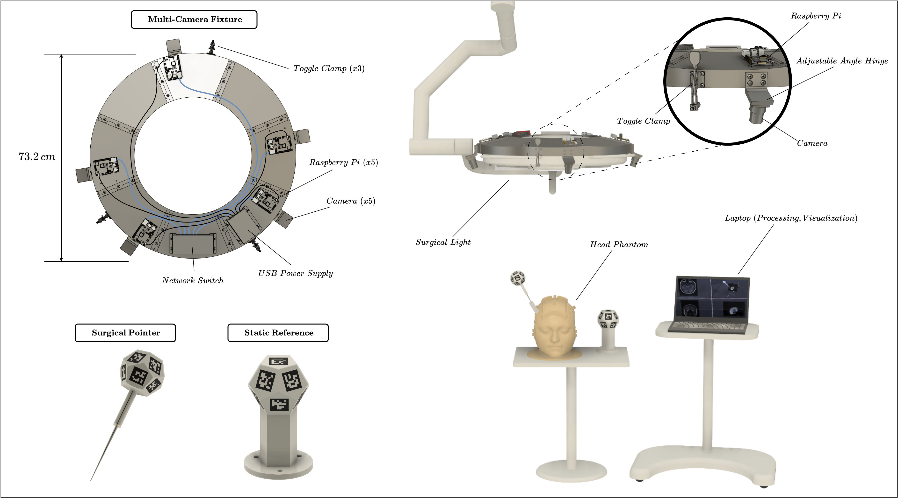
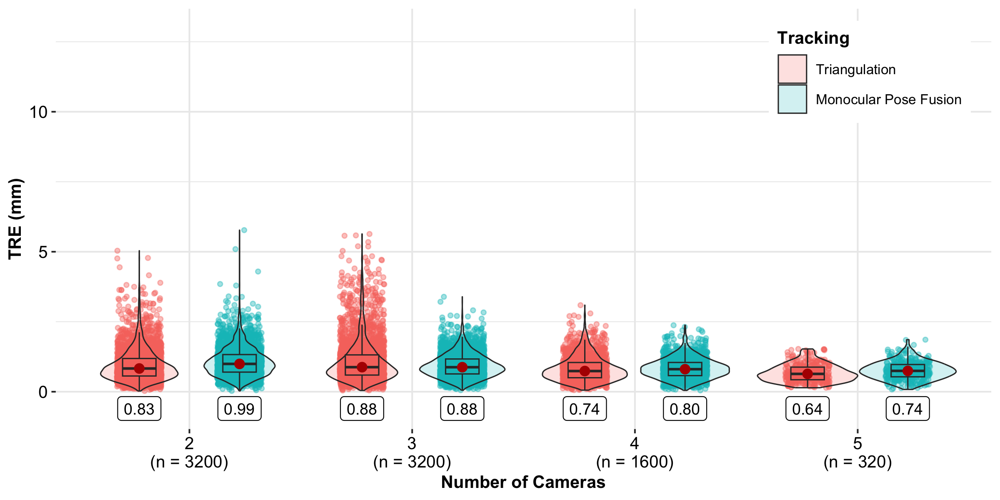
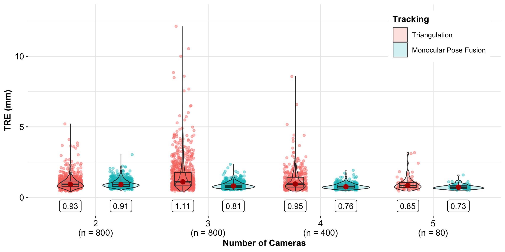

# LARK: A Low-Cost, Accurate, Occlusion-Resilient, Kalman Filter-Assisted Tracking System for Image-Guided Surgery

## Overview

LARK is an open-source, multi-camera optical tracking system designed for image-guided surgery (IGS). The system addresses fundamental limitations of existing commercial solutions by providing sub-millimeter accuracy while being cost-effective and resilient to occlusion. LARK employs a ring-shaped fixture equipped with multiple RGB cameras mounted on a surgical light, enabling continuous tracking of surgical instruments and with respect to static patient references.

This repository contains the complete implementation of the LARK system as described in our publication: **"LARK: A Low-Cost, Accurate, Occlusion-Resilient, Kalman Filter-Assisted Tracking System for Image-Guided Surgery"**.

## Demo


*Real-time tracking demonstration showing the LARK system tracking a surgical pointer during one of our head phantom trials.*

## System Overview



*LARK system architecture showing the multi-camera ring fixture, surgical pointer and static reference, and the head phantom experimental setup.*

## Key Features

- **Sub-millimeter accuracy**: Achieves median target registration errors of 0.64 mm (static) and 0.73 mm (dynamic)
- **Occlusion resilience**: Graceful performance degradation under partial occlusion scenarios
- **Cost-effective**: Order-of-magnitude lower cost than commercial systems (~$1,000 USD vs $8,000-$25,000)
- **Multi-camera architecture**: Ring-shaped fixture with 5 RGB cameras for comprehensive coverage
- **Dual tracking methods**: Multi-view monocular pose fusion and multi-view triangulation
- **Adaptive Kalman filtering**: Dynamic noise adaptation for enhanced tracking stability
- **Real-time integration**: Compatible with IBIS neurosurgical navigation platform

## System Architecture

The LARK system consists of three main components:

### 1. Hardware Platform
- **Multi-camera ring**: 5 RGB cameras (e.g., Raspberry Pi cameras) mounted in a circular fixture
- **Surgical light integration**: Ring attaches to standard surgical lights for optimal positioning
- **Fiducial markers**: Planar ArUco markers on surgical pointer and patient reference
- **Computing platform**: Standard desktop/laptop computer for real-time processing

### 2. Tracking Algorithms
- **Multi-view monocular pose fusion**: Independent pose estimation from each camera with adaptive Kalman filtering
- **Multi-view triangulation**: Corner-based triangulation with robust outlier rejection
- **Adaptive filtering**: Dynamic covariance estimation for optimal sensor fusion

### 3. Software Integration
- **IBIS compatibility**: Real-time visualization on medical imaging data
- **OpenIGTLink support**: Standard protocol for surgical navigation systems
- **Calibration tools**: Comprehensive camera and instrument calibration utilities

## Installation

### Prerequisites
- Python 3.8 or higher
- OpenCV 4.8+ with contrib modules
- Compatible RGB cameras (tested with Raspberry Pi cameras)

### Setup

1. Install Python dependencies:
```bash
pip install -r requirements.txt
```

2. Hardware setup:
   - Assemble the multi-camera ring fixture
   - Connect cameras to computing platform
   - Print and mount fiducial markers on surgical tools

## Usage

### Camera Calibration
Perform intrinsic and extrinsic calibration for all cameras:
```bash
cd Calibration
python camera_calibration.py
```

Configure calibration parameters by editing the script variables:
- `INTRINSIC = True`: Calibrate camera matrices and distortion coefficients
- `EXTRINSIC = True`: Calibrate camera-to-camera relationships
- `TAGBASED = False`: Use ChArUco board corners (recommended)
- `cams = [1,2,3,4,5]`: Specify cameras to calibrate

### Instrument Calibration
Calibrate both surgical pointer and patient reference using ChArUco board:
```bash
cd Calibration
python tool_calibration.py
```

This script handles calibration for both:
- **Surgical pointer**: Requires ChArUco board for tip localization
- **Patient reference**: Static fiducial marker calibration

### Real-time Tracking
Launch the tracking system:
```bash
cd Tracking
python real_multicam.py
```

Configure tracking parameters by editing the script variables:
- `KALMAN = True`: Enable adaptive Kalman filtering
- `ADAPTIVE = True`: Use adaptive covariance estimation
- `STEREO_TRIANGULATE_ALL = True`: Use multi-view triangulation
- `cams = [1,2,3,4,5]`: Specify active camera IDs

### Data Collection and Analysis

The experimental validation pipeline consists of multiple stages:

#### 1. Static Kalman Filter Calibration
First, collect noise characterization data for the static Kalman filter:
```bash
cd Tracking
python kalman_initialization.py
```
This script records tracking data in a specific format optimized for noise analysis.

#### 2. Kalman Filter Parameter Generation
Process the noise data to generate Q and R matrices and create noise profiling heatmaps:
```bash
cd Calibration
python kalman_calibration.py
```
This produces the covariance matrices used by the static Kalman filter and generates visualization heatmaps showing noise characteristics across the tracking volume.

#### 3. Experimental Data Collection
For experimental validation, record tracking sessions using prerecorded videos:
```bash
cd Tracking
python data_collection.py
```
This script processes prerecorded video files and writes tracking results to JSON files. Configure the video source and time range by editing:
- `PRERECORDED = True`: Use prerecorded videos instead of live cameras
- `TIME_RANGE = (0, 999)`: Specify video time range in seconds
- Video path settings in the script

#### 4. Results Analysis
Process the JSON tracking data to compute accuracy metrics:
```bash
python data_processing.py
```
This script reads the JSON files generated by data collection and computes Target Registration Error (TRE) and Fiducial Registration Error (FRE).

#### 5. Statistical Analysis
Perform comprehensive statistical analysis and visualization:
```bash
Rscript results_analysis.R
```
This R script generates the statistical comparisons, significance testing, and distribution plots shown in the paper.

## Repository Structure

```
LARK/
├── Calibration/           # Camera and instrument calibration
│   ├── camera_calibration.py    # Multi-camera calibration
│   ├── tool_calibration.py      # Instrument calibration (pointer & reference)
│   ├── kalman_calibration.py    # Kalman filter parameter estimation
│   ├── image_capture.py         # Calibration image acquisition
│   ├── board_generation.py      # Calibration board generation
│   ├── calib_files/             # Calibration data storage
│   ├── calib_images/            # Calibration images
│   └── noise_figs/              # Noise analysis figures
├── Tracking/              # Real-time tracking implementation
│   ├── real_multicam.py   # Main multi-camera tracking application
│   ├── real.py            # Single camera tracking
│   ├── data_collection.py # Data recording utilities
│   ├── data_processing.py # Accuracy analysis tools
│   ├── results_analysis.R # Statistical analysis and visualization
│   ├── kalman_initialization.py # Data recording for static Kalman filter covariance matrices
│   ├── util/              # Core tracking algorithms
│   │   ├── pose_estimation.py   # Pose estimation utilities
│   │   ├── kalman.py           # Kalman filter implementation
│   │   ├── dodecaBoard.py      # Dodecagonal board detection
│   │   └── landmark_registration.py # Registration algorithms
│   └── video/             # Video recording utilities
│       ├── recordVideo.py
│       └── recordVideo_onPi.py
├── Landmarks/             # Ground truth data and fusion plugins
│   ├── Slicer Plugins # Custom 3D Slicer plugins for ground truth extraction
│   └── Ground Truth # Reference point and trajectory data
├── MarkerGeneration/      # Fiducial marker generation tools
│   ├── charucoGenerator.py     # ChArUco board generation
│   ├── gen_dodeca_tile.py      # Dodecagonal marker generation
│   ├── CharucoBoards/          # Generated ChArUco boards
│   └── GeneratedMarkers/       # Generated ArUco markers
├── RaspberryPi/          # Raspberry Pi camera streaming
│   ├── opencvStreaming.py      # Camera streaming service
│   ├── gstreamerCameraRing.service # System service configuration
│   └── shutdown.sh             # Shutdown script
└── IBIS/                 # IBIS integration files
    ├── *.xfm      # Coordinate transformations
    ├── *.ply                   # 3D models
    ├── *.nii                   # Medical imaging data
    └── *.tag                   # Landmark definitions
```

## Experimental Validation

The system has been validated through comprehensive experiments:

### Test Configurations
- **Grid experiment**: Machined 400×400mm precision grid for baseline accuracy
- **Head phantom experiment**: SLA-printed anatomical phantom for realistic surgical conditions
- **Occlusion scenarios**: Systematic evaluation under specific camera configurations

### Performance Metrics
- **Target Registration Error (TRE)**: Primary accuracy measure
- **Fiducial Registration Error (FRE)**: Calibration quality indicator

### Results Summary
- Static tracking TRE: **0.64 mm** (median, 5 cameras, multi-view triangulation on grid experiment)
- Dynamic tracking TRE: **0.73 mm** (median, 5 cameras, monocular pose fusion on grid experiment)
- Graceful degradation under occlusion
- Real-time performance at 30-35 FPS

#### Point Target Registration Error Results (Grid Experiment)



*Target Registration Error (TRE) for static point tracking across different tracking methods and camera configurations on the machined precision grid.*

#### Trajectory Tracking Performance (Grid Experiment)



*Trajectory Target Registration Error (TRE) for dynamic trajectory tracking showing performance across different methods on the machined precision grid.*

## Data Availability

Complete datasets used in our validation experiments are available as Supplementary Video and at:
https://nist.mni.mcgill.ca/data/

This includes:
- Trial videos for both grid and head phantom experiments
- Video-specific ground truth measurements from commercial tracker

## Citation

If you use LARK in your research, please cite our preprint:

**Sideris, G.**, Cree, J., Stirling, A., et al. (2025). *LARK: A Low-Cost, Accurate, Occlusion-Resilient, Kalman Filter-Assisted Tracking System for Image-Guided Surgery*. Research Square Preprint (Version 1). https://doi.org/10.21203/rs.3.rs-7622287/v1

```bibtex
@article{sideris2025lark,
  title={LARK: A Low-Cost, Accurate, Occlusion-Resilient, Kalman Filter-Assisted Tracking System for Image-Guided Surgery},
  author={Sideris, George and Cree, Justin and Stirling, Andrew and others},
  journal={Research Square},
  note={Preprint (Version 1)},
  month={September},
  year={2025},
  doi={10.21203/rs.3.rs-7622287/v1},
  url={https://www.researchsquare.com/article/rs-7622287/v1}
}
```

**Preprint:** https://www.researchsquare.com/article/rs-7622287/v1

## License

This work is licensed under [CC BY 4.0](https://creativecommons.org/licenses/by/4.0/). You are free to use, modify, and distribute this code with appropriate attribution. Please cite the above publication if you use this code in your work.

---
